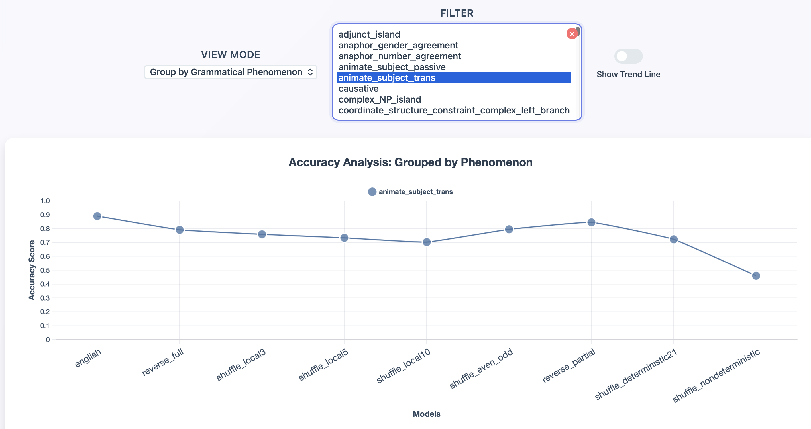

# When transformers learn “impossible” languages, what do they learn?

This repository contains all code used as part of the CoNLL 2026 paper ("When transformers learn “impossible” languages, what do they learn?") [TODO: Insert link]

If you use our code, please cite our paper:
[TODO: Insert citation]


## Replication
This repository contains all code and data necessary to fully replicate the results of Experiments 1 and 2 in our paper. To quickly do this, first setup a Python 3.13 environment, then install the requriements, e.g.:

```bash
conda create -n impossible-languages python=3.13.2
conda activate impossible-languages
conda install pip
python -m pip install -r requirements.txt
```

After this, you can replicate all the experiments by simply running
```bash
snakemake -j 1
```

The `-j` flag allows you to specify the number of parallel jobs you'll allow your machine to run. There are a couple of other flags worth knowing:

`--config num_gen_samples=N` sets the number of samples generated for per impossible language in Experiment 2 (default=1000).
`--config batch_size=N` sets the batch size for evaluating perplexity (default=16).

To replicate the minimal pair results only, you can run:
```bash
snakemake -j 1 output/blimp/results.csv
```
This will download the BLiMP dataset, filter out pairs with mismatched tokenizations, generate ``impossible`` versions of the BLiMP dataset, and then evaluate the respective model on the dataset.

To produce and score the generations for Experiment 2, you can run:
```bash
snakemake -j 1 output/generation/scores/generation_scores_gpt2.csv
```

To replicate the quantile analysis and figure from Experiment 2, run
```bash
snakemake -j 1 output/figures/proportion_below_english_perplexity.pdf
```

Generally, the `Snakefile` in this repo specifies the computation graph of intermediate results for replicating our experiments; start there to explore the codebase. 

## Visualisation of results

A GUI is provided in the `gui` directory that loads results from `experiments/output/results.csv`. It shows comparisons between models across specific/all BLiMP grammatical phenomena, or results across all models on different BLiMP grammatical phenomena, like so (multi-select can be enabled):



To view the GUI at: http://localhost:<your_preferred_port>, run the following command:

```bash
python -m uvicorn gui.main:app --host ******* --port <your_preferred_port> --reload
```